# Meal Planner Application

A comprehensive meal planning system with a Flutter frontend and Node.js backend that helps users plan meals, track nutritional goals, and discover new recipes.

## Project Structure

The application consists of two main components:

1. **Flutter Frontend (UI)**: A mobile application for iOS and Android that provides the user interface
2. **Node.js Backend (Server)**: RESTful API server that handles data storage and business logic

## Contributors

This project is developed and maintained by:

- **[Osman Demiroz](https://github.com/osmandemiroz)** - Frontend Development (UI)
- **[Gunes Berkay](https://github.com/Gunes-Berkay)** - Backend Development & Database

## Frontend (Flutter)

The UI is built with Flutter, following Apple's Human Interface Guidelines to create a sleek, modern interface with smooth animations.

### Key Features

- **Meal Plan**: Create and manage daily meal plans
- **Recipes**: Browse, search, and filter recipes by various criteria
- **Goals**: Set and track nutritional and health goals with detailed insights
- **Profile**: Manage user preferences and settings
- **About**: Elegant app information screen with animations

### Screenshots

#### Authentication
<div style="display: flex; flex-wrap: wrap; gap: 10px;">
  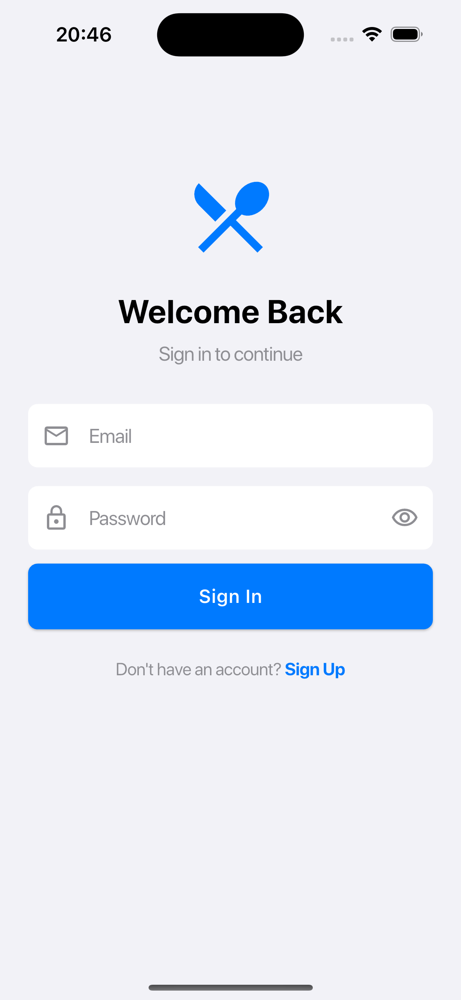
  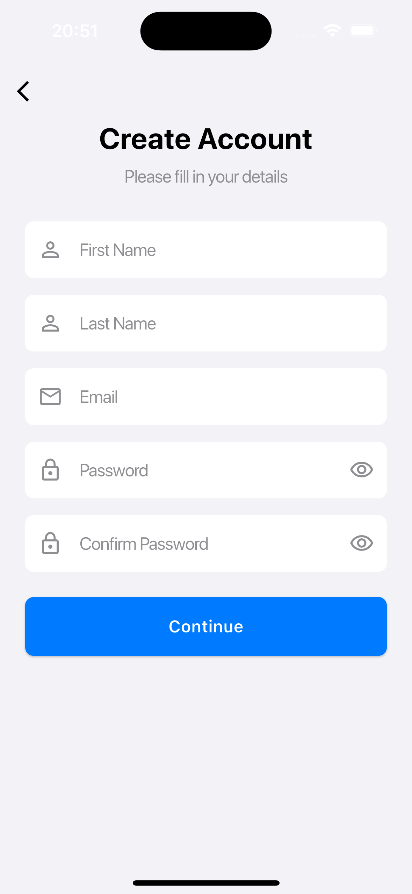
  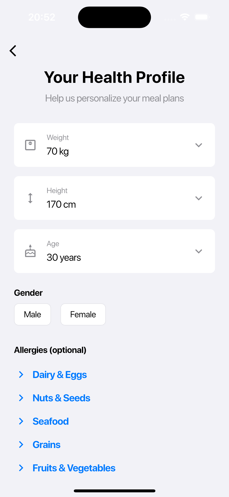
</div>

#### Meal Planning
<div style="display: flex; flex-wrap: wrap; gap: 10px;">
  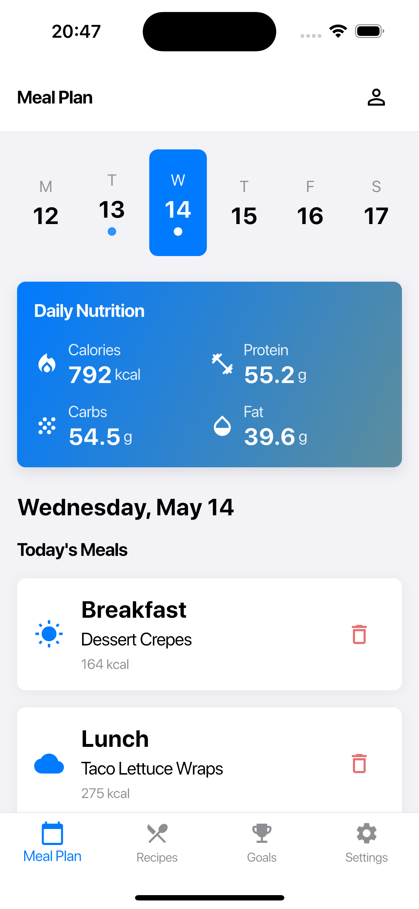
</div>

#### Recipes
<div style="display: flex; flex-wrap: wrap; gap: 10px;">
  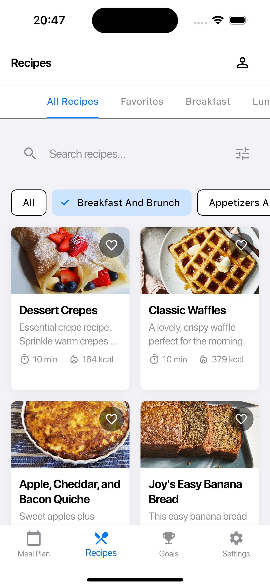
  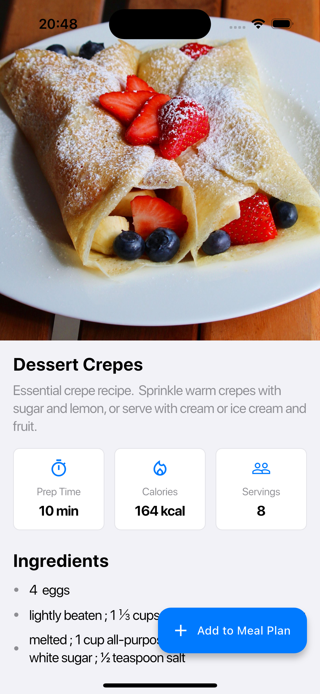
  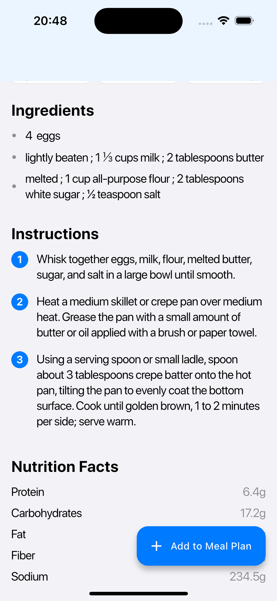
  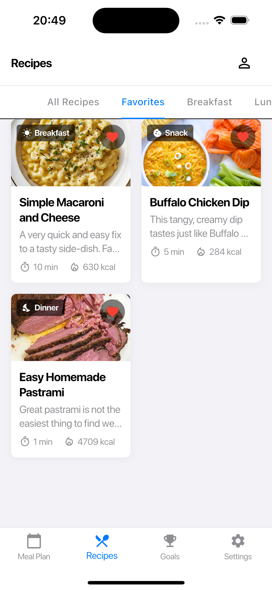
  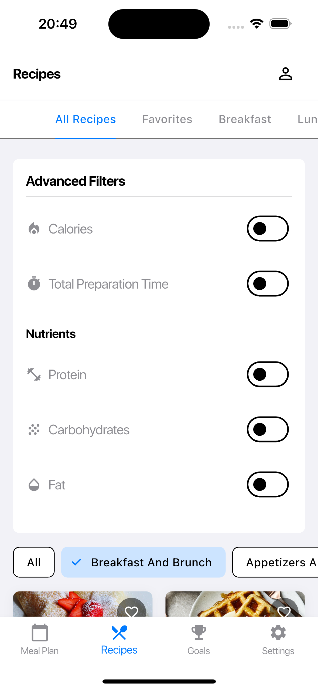
</div>

#### Goals
<div style="display: flex; flex-wrap: wrap; gap: 10px;">
  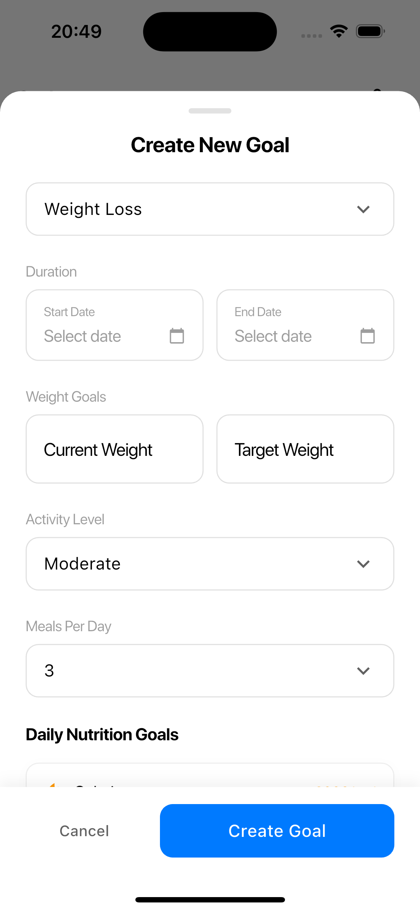
  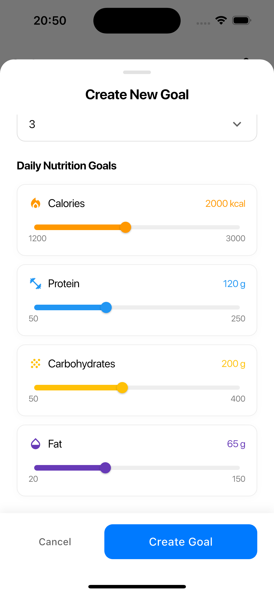
  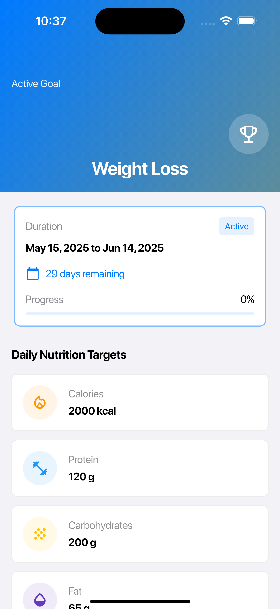
</div>

#### Settings & Profile
<div style="display: flex; flex-wrap: wrap; gap: 10px;">
  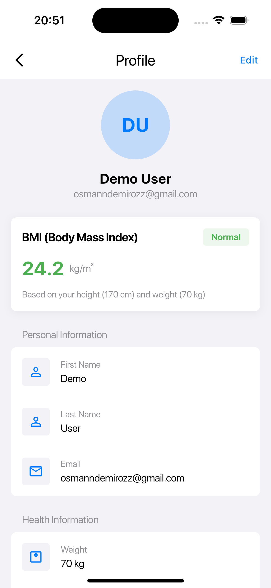
  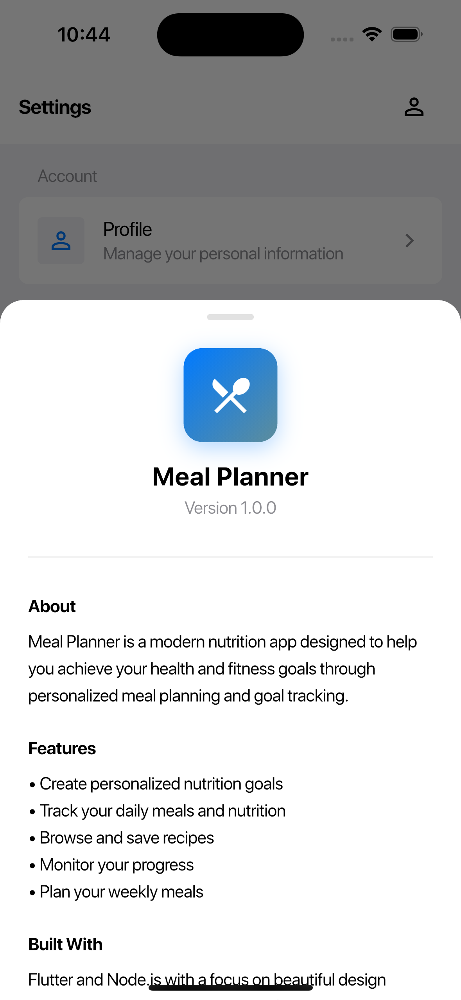
</div>

### UI Architecture

The Flutter application follows a clean architecture pattern:

- **Views**: UI screens (meal_plan, recipes, goals, settings)
- **Models**: Data structures (recipe, meal_plan, goal, user)
- **Services**: API communication (api_service, auth_service)
- **Providers**: State management with Provider package
- **Widgets**: Reusable UI components

### Recent Updates

- **Goal Details Screen**: Added detailed view for nutritional goals with progress tracking
- **About Screen**: New elegant about screen following Apple's Human Interface Guidelines
- **UI Enhancements**: Improved animations and transitions throughout the app
- **Performance Optimizations**: Better loading states and cached data

## Backend (Node.js)

The server is built with Node.js and Express, providing a RESTful API for the frontend.

### API Endpoints

- **/api/users**: User management (registration, login, profile)
- **/api/recipes**: Recipe CRUD operations with advanced search and filtering
- **/api/goals**: Goal setting and tracking
- **/api/userMealPlan**: Meal planning functionality

### Database

Uses SQLite database (recipe_db.db) to store:
- User information
- Recipes with nutritional data
- Meal plans
- User goals and progress

## Getting Started

### Prerequisites

- Flutter SDK
- Node.js and npm
- SQLite

### Setup and Installation

1. **Clone the repository**
   ```bash
   git clone [repository URL]
   ```

2. **Setup the Flutter frontend**
   ```bash
   cd mealprojectwithnodejs
   flutter pub get
   ```

3. **Setup the Node.js backend**
   ```bash
   cd server
   npm install
   ```

4. **Run the backend server**
   ```bash
   npm start
   ```

5. **Run the Flutter app**
   ```bash
   flutter run
   ```

## Architecture

The application follows a client-server architecture:

- **Frontend**: Flutter handles UI rendering and state management ([@osmandemiroz](https://github.com/osmandemiroz))
- **Backend**: Node.js provides RESTful API endpoints ([@Gunes-Berkay](https://github.com/Gunes-Berkay))
- **Database**: SQLite stores all persistent data ([@Gunes-Berkay](https://github.com/Gunes-Berkay))

## Technical Features

- Responsive UI design for various screen sizes
- Authentication and authorization
- Real-time data synchronization
- Offline capability with local storage
- Advanced recipe search and filtering
- Nutritional calculation and tracking
- Smooth animations and transitions
- Apple Human Interface Guidelines compliance

## Development

The project uses:
- Flutter for cross-platform mobile development
- Provider for state management
- Node.js with Express for backend API
- SQLite for database storage
- Flutter Animate for beautiful animations

## Contact

For questions regarding:
- UI/Frontend: Contact [@osmandemiroz](https://github.com/osmandemiroz)
- Backend/Database: Contact [@Gunes-Berkay](https://github.com/Gunes-Berkay)
